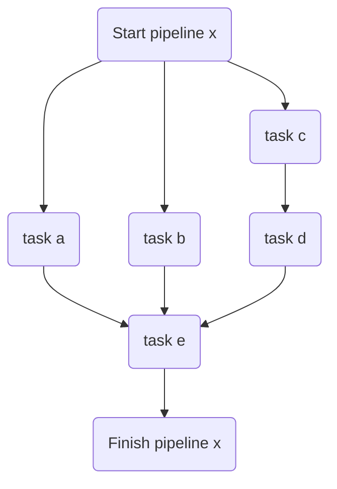
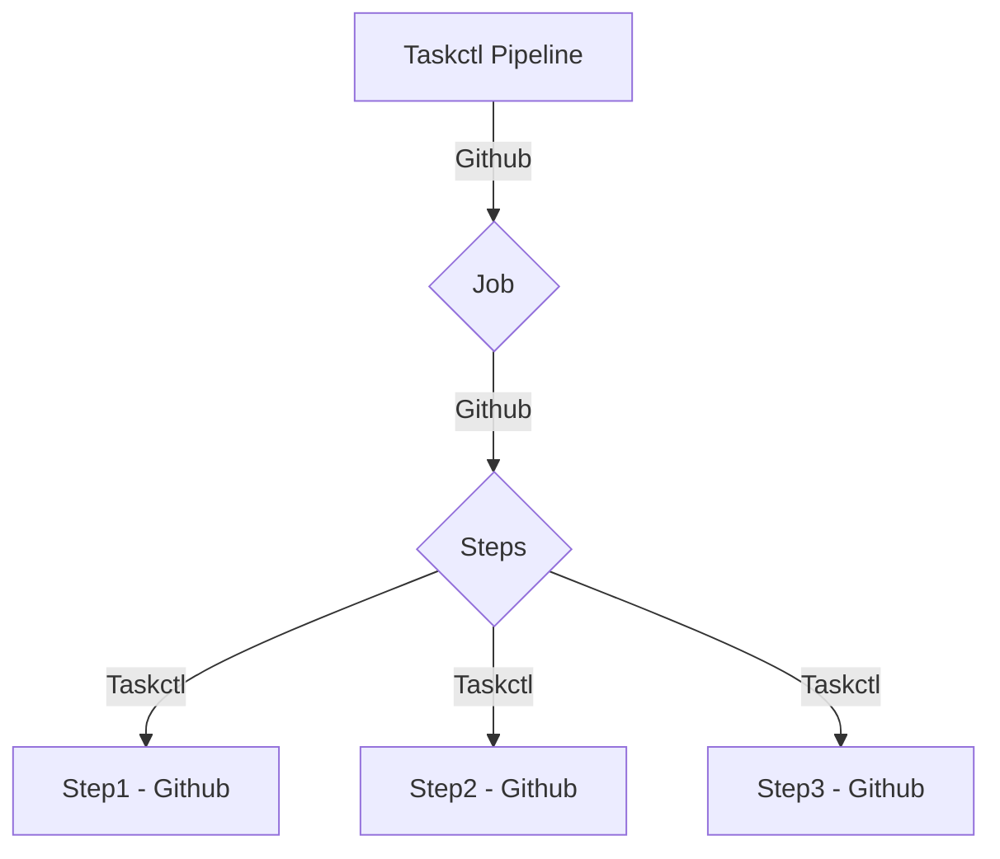

# Generator

Generate a CI yaml file(s) - [the initial discussion](https://github.com/Ensono/taskctl/issues/16)

## Internals

The internal execution graph can be thought of as an n-ary tree with nodes (Stages), the root will be a taskctl "pipeline".

Where a pipeline can be a collection of tasks that are executed in parallel or in an order set by the `depends on` keyword.

The example above shows `pipeline x` - starting by executing tasks a,b,c in parallel. `task d` waiting for `task c` to finish. 

`task e` waits for `task a`, `task b` and `task d` to complete before running.

## Implementation

Taskctl properties need to be mapped to the specific CI implementations

## Supported Generators

The list of supported generators will grow as more are added. To add an additional "generator", one needs to follow the existing strategy pattern in the [genci package](../internal/genci/genci.go), see example [githubimpl](../internal/genci/githubimpl.go) for an example (still in beta).

Currently implemented:

    - Github
    - ...

## Sample outputs

[GHA sample](../.github/workflows/gha__e__infra__e__sample.yml)
