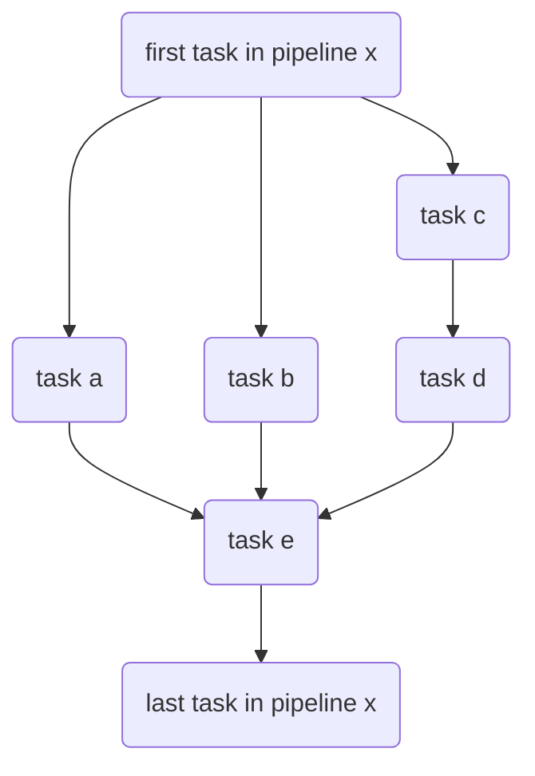

# Internals

The internal execution graph can be thought of as a unary tree with nodes (Stages), the root will be a taskctl "pipeline".

Where a pipeline can a collection of tasks that are executed in parallel or in an order set by the `depends on` keyword.

The example above shows `pipeline x` - starting by executing tasks a,b,c in parallel. `task d` waiting