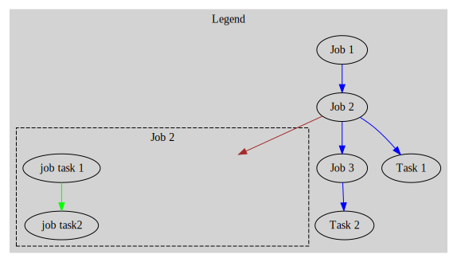
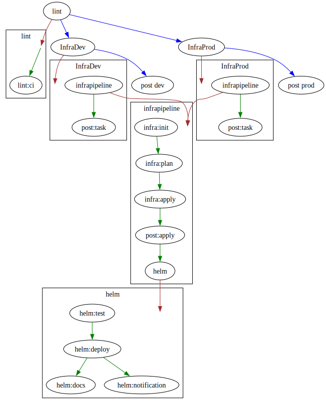
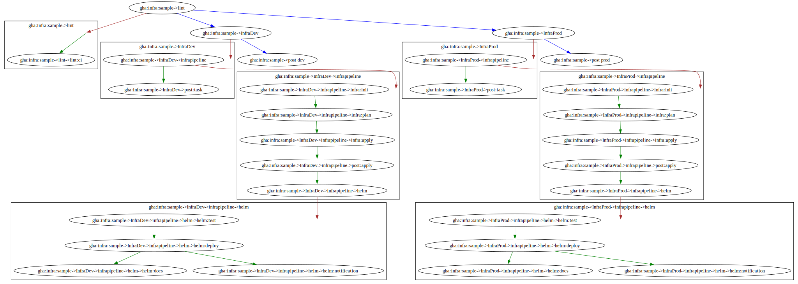

# Graph Internals

The internal processes generate, essentially, an n-ary tree.
The tree may have nodes which themselves are other trees. 

> There are never any edges between nodes in a child tree to the parent tree, i.e. only single level stages (nodes) can `depends_on` on each other.

The generated graphs will have the following legend, it can also be embedded in the generated digraph by specifying the `--legend` flag.



Blue arrows are the first level stages in the pipeline, these can be direct tasks or other pipelines.

Brown arrows denote a job that is a pipeline itself and points to the subgraph that represents that pipeline.

Green arrows are point from stage to stage (stage can be a task or a pipeline) in any subgraphs.

## Normalized vs Denormalized

Both graphs are useful for different reasons.

The normalized graph will aid in understanding visually how the execution will happen and highlighting any re-useable components (tasks or pipelines).

The denormalized graph is what needs to be generated for the actual scheduled run, this is so that each instance of the step and all its parents are unique even if they are coming from shared steps. Thus ensuring that each path of the tree has a unique path.

To illustrate the point we can see the differences below across the same "pipeline".

### Normalized

The generated tree can be viewed in both the normalized form using the graph command.

`taskctl graph gha:infra:sample -c ./cmd/taskctl/testdata/gha.sample.yml | dot -Tsvg -o normalized.svg`



### Denormalized

When running the run command with the `--graph-only` it would generate the denormalized tree graph.

`taskctl run gha:infra:sample -c ./cmd/taskctl/testdata/gha.sample.yml --graph-only | dot -Tsvg -o docs/svg/denormalized.svg`



## Environment Variables

With denormalization performed for each `run` command we can perform a hierarchical environment variable manipulation, that means that injected environment variables can now be inherited from the parent.

### Inheritance

The general flow of inheritance is from the more general to the more specific, i.e. `Context < Pipeline < Task`.

That means that anything set in the context level will always be injected into the pipeline and task, unless the same key is set in the pipeline in which case it will be overwritten.

Anything set in a task will overwrite previouusly set env keys.

### Precedence

The tree is walked backwards to the first ancestor, as such it means that a task or a pipeline can have multiple levels "pipelines" of env keys set. Consider the below example of the `tester` pipeline.

```yaml
pipelines:
  wrapped: 
    - task: task:three
    - task: task:four
      depends_on:
        - task:three
      env: 
        FOO: task-set-val-always-wins

  action:one:
    - task: task:five
    - name: do-this
      pipeline: wrapped
      env:
        SOME: set-level-1
        OTHER: this-do
      depends_on:
        - task:five

  action:two:
    - task: task:five
    - name: do-that
      pipeline: wrapped
      depends_on:
        - task:five

  tester:
    - task: task:one
    - task: task:two
      depends_on:
        - task:one
    - pipeline: action:one
      depends_on:
        - task:one
      env:
        SOME: this
    - pipeline: action:two
      depends_on:
        - task:one
      env:
        SOME: that
```

The path to `task:four` can be achieved in the following ways:

- `tester->action:one->do-this->task:four`
    - `action:one` is a pipeline that has a child `do-this` which is another pipeline, an alias to the `wrapped` pipeline which has the `task:four` in it.
    - `task:four` will have these values:
        - `FOO: task-set-val-always-wins`
        - `SOME: set-level-1`
        - `OTHER: this-do`
    - `SOME` would be overwritten inside the `acion:one` `do-this` pipeline.

- `tester->action:two->do-that->task:four`
    - `action:two` is a pipeline that has a child `do-that` which is another pipeline, an alias to the `wrapped` pipeline which has the `task:four` in it.
    - `task:four` will have these values:
        - `FOO: task-set-val-always-wins`
        - `SOME: that`
    - `SOME` would be inherited the `tester` referenced `action:two` pipeline.

